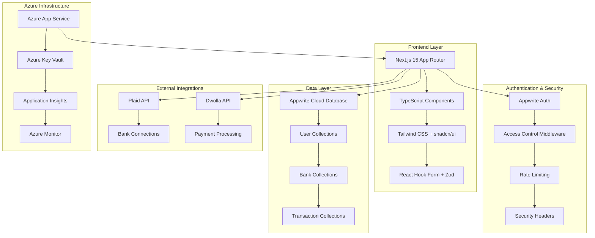

<div align="center">
  
  
  <h1 align="center">🏦 Horizon Banking Portal</h1>
  <p align="center">
    <strong>Enterprise-Grade Private Banking Platform</strong><br>
    Secure • Scalable • Azure-Ready
  </p>
  
  <div align="center">
    
    
    
    
    
    
  </div>

  <br />
  
  <div align="center">
    <a href="#features">Features</a> •
    <a href="#quick-start">Quick Start</a> •
    <a href="#deployment">Azure Deployment</a> •
    <a href="#documentation">Documentation</a> •
    <a href="#security">Security</a>
  </div>
</div>

<br />

> **🚀 Production Ready**: This banking portal is enterprise-ready with comprehensive Azure deployment guides, security hardening, and extensive documentation for private banking operations.

---

## 📋 Table of Contents

- [🎯 Overview](#overview)
- [✨ Key Features](#features)
- [🏗️ Architecture](#architecture)
- [⚙️ Tech Stack](#tech-stack)
- [🚀 Quick Start](#quick-start)
- [🌐 Azure Deployment](#deployment)
- [🔒 Security Features](#security)
- [📚 Documentation](#documentation)
- [🧪 Testing](#testing)
- [🎨 Theming & Branding](#theming)
- [🔧 Configuration](#configuration)
- [📊 Monitoring](#monitoring)
- [🤝 Contributing](#contributing)
- [📄 License](#license)

---

## 🎯 Overview {#overview}

**Horizon Banking Portal** is an enterprise-grade private banking platform designed for secure financial operations. Built with modern technologies and deployed on Microsoft Azure, it provides comprehensive banking services with advanced security measures and compliance features.

### 🌟 What Makes It Special

- **🏦 Private Banking Focus**: Tailored for high-net-worth individuals and private banking operations
- **🛡️ Enterprise Security**: Multi-layer security with rate limiting, access controls, and audit trails
- **☁️ Azure-Native**: Designed for seamless deployment on Microsoft Azure with UAE compliance
- **📱 Modern UX**: Beautiful, responsive interface with Horizon branding
- **🔄 Real-time Operations**: Live transaction monitoring and instant updates
- **📊 Comprehensive Reporting**: Advanced export capabilities with PDF statements and CSV data

---

## ✨ Key Features {#features}

### 🔐 **Authentication & Access Control**
- **Secure SSR Authentication**: Ultra-secure server-side rendering with proper validations
- **Access Control Lists**: Email-based allowlisting with `ALLOWED_EMAILS` configuration
- **Session Management**: Comprehensive user session handling with automatic expiry

### 🏦 **Banking Operations**
- **Multi-Bank Integration**: Connect multiple bank accounts via Plaid integration
- **Real-time Transactions**: Live transaction monitoring and instant balance updates
- **Manual Transaction Entry**: Complete workflow for manual transaction recording
- **Fund Transfers**: Secure money transfers using Dwolla payment infrastructure

### 📊 **Financial Management**
- **Dashboard Overview**: Comprehensive financial summary with balance aggregation
- **Transaction History**: Advanced filtering, pagination, and search capabilities
- **Category Analytics**: Spending analysis with visual charts and insights
- **Account Management**: Complete bank account details and management tools

### 📋 **Reporting & Exports**
- **CSV Export**: Filtered transaction exports with customizable date ranges
- **PDF Statements**: Branded monthly/quarterly statements with bank logos
- **Statement Dashboard**: Unified view of all account statements and exports
- **Print-Ready Reports**: Professional formatting for physical document needs

### 🎨 **Branding & Customization**
- **Horizon Theme**: Professional banking theme with blue-gold color palette
- **Legal Compliance**: Built-in disclaimer pages and regulatory compliance
- **Responsive Design**: Seamless experience across desktop, tablet, and mobile
- **Accessibility**: WCAG-compliant design with screen reader support

### 🛡️ **Security & Compliance**
- **Rate Limiting**: API endpoint protection with configurable limits
- **Security Headers**: Comprehensive HTTP security headers implementation
- **Audit Logging**: Complete transaction and access logging
- **Data Encryption**: End-to-end encryption for sensitive financial data

### 🚀 **Feature Flags & Configuration**
- **Plaid Toggle**: `NEXT_PUBLIC_ENABLE_PLAID` - Enable/disable bank linking
- **Transfer Toggle**: `NEXT_PUBLIC_ENABLE_TRANSFERS` - Control money transfer features
- **Environment-Specific**: Different configurations for development, staging, production

---

## 🏗️ Architecture {#architecture}



### **Key Architectural Decisions**

- **🎯 Server-Side Rendering**: Optimized performance with Next.js App Router
- **☁️ Cloud-Native**: Appwrite Cloud for scalable backend services
- **🔒 Security-First**: Multiple security layers with rate limiting and access controls
- **📊 Monitoring**: Comprehensive logging and monitoring with Azure services
- **🌐 API-First**: RESTful APIs with proper error handling and validation

---

## ⚙️ Tech Stack {#tech-stack}

### **Frontend**
- **[Next.js 15](https://nextjs.org/)** - React framework with App Router
- **[TypeScript](https://www.typescriptlang.org/)** - Type-safe JavaScript
- **[Tailwind CSS](https://tailwindcss.com/)** - Utility-first CSS framework
- **[shadcn/ui](https://ui.shadcn.com/)** - Modern UI component library
- **[React Hook Form](https://react-hook-form.com/)** - Performant form handling
- **[Zod](https://zod.dev/)** - Schema validation library
- **[Chart.js](https://www.chartjs.org/)** - Data visualization

### **Backend & Database**
- **[Appwrite Cloud](https://appwrite.io/)** - Backend-as-a-Service platform
- **[Node.js Runtime](https://nodejs.org/)** - Server-side JavaScript execution
- **Server Actions** - Next.js server-side data mutations

### **Payment & Banking**
- **[Plaid](https://plaid.com/)** - Bank account linking and verification
- **[Dwolla](https://www.dwolla.com/)** - ACH payment processing
- **Real-time Webhooks** - Instant transaction updates

### **Infrastructure & DevOps**
- **[Microsoft Azure](https://azure.microsoft.com/)** - Cloud platform
- **[Azure App Service](https://azure.microsoft.com/en-us/services/app-service/)** - Web application hosting
- **[Azure Key Vault](https://azure.microsoft.com/en-us/services/key-vault/)** - Secrets management
- **[Application Insights](https://azure.microsoft.com/en-us/services/monitor/)** - Application monitoring

### **Security & Compliance**
- **Rate Limiting** - API protection with configurable limits
- **HTTPS Enforcement** - End-to-end encryption
- **Security Headers** - Comprehensive HTTP security
- **Access Controls** - Email-based allowlisting

---

## 🚀 Quick Start {#quick-start}

### **Prerequisites**

Ensure you have the following installed:

- **[Node.js 18+](https://nodejs.org/)** - JavaScript runtime
- **[Git](https://git-scm.com/)** - Version control
- **[npm](https://www.npmjs.com/)** or **[yarn](https://yarnpkg.com/)** - Package manager

### **1. Clone the Repository**

```bash
git clone https://github.com/CoronovirusG10/evidencing.git
cd banking
```

### **2. Install Dependencies**

```bash
npm install
```

### **3. Environment Configuration**

Create a `.env.local` file in the root directory:

```env
# Application
NEXT_PUBLIC_SITE_URL=http://localhost:3000

# Appwrite Configuration
NEXT_PUBLIC_APPWRITE_ENDPOINT=https://cloud.appwrite.io/v1
NEXT_PUBLIC_APPWRITE_PROJECT=your_project_id
APPWRITE_DATABASE_ID=your_database_id
APPWRITE_USER_COLLECTION_ID=your_user_collection_id
APPWRITE_BANK_COLLECTION_ID=your_bank_collection_id
APPWRITE_TRANSACTION_COLLECTION_ID=your_transaction_collection_id
NEXT_APPWRITE_KEY=your_server_api_key

# Access Control
ALLOWED_EMAILS=admin@yourbank.com,manager@yourbank.com

# Feature Flags
NEXT_PUBLIC_ENABLE_PLAID=true
NEXT_PUBLIC_ENABLE_TRANSFERS=true

# Plaid Integration
PLAID_CLIENT_ID=your_plaid_client_id
PLAID_SECRET=your_plaid_secret
PLAID_ENV=sandbox
PLAID_PRODUCTS=transactions,auth,identity
PLAID_COUNTRY_CODES=US,CA

# Dwolla Integration
DWOLLA_KEY=your_dwolla_key
DWOLLA_SECRET=your_dwolla_secret
DWOLLA_BASE_URL=https://api-sandbox.dwolla.com
DWOLLA_ENV=sandbox
```

### **4. Database Setup**

Follow the [Appwrite Cloud Setup Guide](docs/appwrite-cloud-setup.md) to configure your database collections.

### **5. Run the Application**

```bash
# Development mode
npm run dev

# Production build
npm run build
npm start
```

The application will be available at `http://localhost:3000`

### **6. Run Tests**

```bash
# Run all tests
npm run test

# Run linting
npm run lint
```

---

## 🌐 Azure Deployment {#deployment}

### **UAE North Region Deployment**

This application is optimized for deployment on Microsoft Azure, specifically in the **UAE North** region for compliance with local regulations.

#### **🔧 Infrastructure Setup**

```bash
# Login to Azure CLI
az login

# Create Resource Group
az group create --name horizon-rg-uae --location "UAE North"

# Create App Service Plan
az appservice plan create \
  --name horizon-asp-uae \
  --resource-group horizon-rg-uae \
  --location "UAE North" \
  --sku P1V3 \
  --is-linux

# Create Web App
az webapp create \
  --name horizon-banking-uae \
  --resource-group horizon-rg-uae \
  --plan horizon-asp-uae \
  --runtime "NODE|20-lts"
```

#### **🔐 Secrets Management**

```bash
# Create Key Vault
az keyvault create \
  --name horizon-kv-uae \
  --resource-group horizon-rg-uae \
  --location "UAE North"

# Add secrets
az keyvault secret set --vault-name horizon-kv-uae --name "appwrite-key" --value "your-key"
az keyvault secret set --vault-name horizon-kv-uae --name "plaid-secret" --value "your-secret"
```

#### **📋 Deployment Checklist**

- [ ] Azure resources provisioned in UAE North
- [ ] Key Vault configured with all secrets
- [ ] App Service configured with Key Vault references
- [ ] Custom domain and SSL certificate configured
- [ ] Application Insights enabled
- [ ] Backup and disaster recovery configured
- [ ] Monitoring and alerts set up

#### **🚀 Package & Deploy**

```bash
# Build the standalone artifact and zip contents
scripts/create-azure-zip.sh

# Deploy to horizon-banking-uae App Service (UAE North)
./deploy-to-azure.sh

# Manual redeploy (if needed)
az webapp deploy --resource-group horizon-rg-uae --name horizon-banking-uae --src-path horizon-internet-banking.zip --type zip
```

After deployment, verify `https://horizon-banking-uae.azurewebsites.net/internet-banking/` renders correctly and run the manual test plan.

The generated archive nests the app inside `internet-banking/` so the Web App can host additional root content without conflicts.

#### **📚 Detailed Guide**

For complete deployment instructions, see: **[Azure Deployment Guide](docs/azure-deployment.md)**

---

## 🔒 Security Features {#security}

### **🛡️ Authentication & Authorization**
- **Multi-layer Authentication**: Appwrite Auth with custom middleware
- **Access Control Lists**: Email-based user allowlisting
- **Session Management**: Secure session handling with automatic expiry
- **Role-based Access**: Granular permissions for different user types

### **🚦 Rate Limiting**
```typescript
// API endpoints protected with rate limiting
const rateLimit = new Map()

// 5 requests per minute for exports
export async function POST(request: Request) {
  const limited = await checkRateLimit(userEmail, 5, 60000)
  if (limited) {
    return new Response('Rate limit exceeded', { status: 429 })
  }
  // Process request...
}
```

### **🔐 Security Headers**
```javascript
// next.config.mjs - Comprehensive security headers
const securityHeaders = [
  { key: 'X-DNS-Prefetch-Control', value: 'on' },
  { key: 'X-XSS-Protection', value: '1; mode=block' },
  { key: 'X-Frame-Options', value: 'SAMEORIGIN' },
  { key: 'X-Content-Type-Options', value: 'nosniff' },
  { key: 'Referrer-Policy', value: 'origin-when-cross-origin' }
]
```

### **📊 Audit & Compliance**
- **Transaction Logging**: Complete audit trail for all financial operations
- **Access Logging**: User access and activity monitoring
- **Data Encryption**: End-to-end encryption for sensitive data
- **Backup Strategy**: Automated backups with point-in-time recovery

---

## 📚 Documentation {#documentation}

### **📖 Available Guides**

| Document | Description |
|----------|-------------|
| **[Azure Deployment Guide](docs/azure-deployment.md)** | Complete Azure deployment instructions for UAE region |
| **[Appwrite Cloud Setup](docs/appwrite-cloud-setup.md)** | Database configuration and collections setup |
| **[Theming Guide](docs/theming-guide.md)** | Customize branding, colors, and UI components |
| **[Manual Test Plan](docs/manual-test-plan.md)** | Comprehensive testing procedures |
| **[Tooling Guide](docs/tooling.md)** | Development tools and pre-commit hooks |
| **[Change Log](docs/CHANGELOG.md)** | Version history and feature updates |

### **🔄 API Documentation**

#### **Transaction Export API**
```typescript
// POST /api/transactions/export
{
  "format": "csv" | "pdf",
  "filters": {
    "startDate": "2024-01-01",
    "endDate": "2024-12-31",
    "accountId": "account_123"
  }
}
```

#### **Manual Transaction API**
```typescript
// POST /api/transactions/manual
{
  "amount": 1000.00,
  "description": "Wire transfer received",
  "category": "deposit",
  "accountId": "account_123"
}
```

---

## 🧪 Testing {#testing}

### **Test Coverage**

```bash
# Run all tests
npm run test

# Run specific test suites
npm run test:csv      # CSV export functionality
npm run test:pdf      # PDF generation
npm run test:auth     # Authentication flows
```

### **Test Structure**
```
tests/
├── csv.test.ts           # CSV export validation
├── pdf.test.ts           # PDF generation testing
├── auth.test.ts          # Authentication testing
└── integration/          # End-to-end tests
    ├── banking.test.ts
    └── exports.test.ts
```

### **Manual Testing**

Follow the comprehensive [Manual Test Plan](docs/manual-test-plan.md) for complete feature validation.

---

## 🎨 Theming & Branding {#theming}

### **🎨 Horizon Brand Colors**

```css
:root {
  /* Primary Colors */
  --primary-blue: #0066CC;
  --primary-gold: #FFD700;
  
  /* Semantic Colors */
  --success: #10B981;
  --warning: #F59E0B;
  --error: #EF4444;
  --info: #3B82F6;
  
  /* Neutral Colors */
  --gray-50: #F9FAFB;
  --gray-900: #111827;
}
```

### **📝 Legal & Compliance**

The platform includes:
- **Legal Disclaimer Pages**: Comprehensive terms and conditions
- **Privacy Policy**: GDPR and regional compliance
- **Banking Regulations**: UAE banking law compliance
- **Audit Trail**: Complete transaction logging

### **🔧 Customization Guide**

For complete branding customization, see: **[Theming Guide](docs/theming-guide.md)**

---

## 🔧 Configuration {#configuration}

### **Environment Variables**

| Variable | Description | Required | Default |
|----------|-------------|----------|---------|
| `NEXT_PUBLIC_SITE_URL` | Application base URL | ✅ | - |
| `NEXT_PUBLIC_APPWRITE_ENDPOINT` | Appwrite API endpoint | ✅ | `https://cloud.appwrite.io/v1` |
| `NEXT_PUBLIC_APPWRITE_PROJECT` | Appwrite project ID | ✅ | - |
| `APPWRITE_DATABASE_ID` | Database identifier | ✅ | - |
| `NEXT_APPWRITE_KEY` | Server API key | ✅ | - |
| `ALLOWED_EMAILS` | Comma-separated allowed emails | ✅ | - |
| `NEXT_PUBLIC_ENABLE_PLAID` | Enable Plaid integration | ❌ | `true` |
| `NEXT_PUBLIC_ENABLE_TRANSFERS` | Enable transfer features | ❌ | `true` |
| `PLAID_CLIENT_ID` | Plaid client identifier | ⚠️ | - |
| `PLAID_SECRET` | Plaid secret key | ⚠️ | - |
| `DWOLLA_KEY` | Dwolla API key | ⚠️ | - |
| `DWOLLA_SECRET` | Dwolla secret key | ⚠️ | - |

**Legend:** ✅ Required | ❌ Optional | ⚠️ Required if feature enabled

### **Feature Flags**

```typescript
// Feature flag configuration
export const featureFlags = {
  plaidEnabled: process.env.NEXT_PUBLIC_ENABLE_PLAID === 'true',
  transfersEnabled: process.env.NEXT_PUBLIC_ENABLE_TRANSFERS === 'true',
  rateLimit: {
    exports: 5,        // requests per minute
    windowMs: 60000    // 1 minute
  }
}
```

---

## 📊 Monitoring {#monitoring}

### **Azure Application Insights**

```typescript
// Application monitoring setup
import { ApplicationInsights } from '@microsoft/applicationinsights-web'

const appInsights = new ApplicationInsights({
  config: {
    instrumentationKey: process.env.APPINSIGHTS_INSTRUMENTATIONKEY,
    enableAutoRouteTracking: true,
    enableCorsCorrelation: true
  }
})
```

### **Key Metrics Tracked**

- **Performance**: Page load times, API response times
- **Usage**: User sessions, feature adoption
- **Errors**: Application exceptions, failed transactions
- **Security**: Failed authentication attempts, rate limit hits

### **Monitoring Dashboard**

Access your monitoring dashboard at:
- **Azure Portal**: Application Insights overview
- **Custom Dashboards**: Performance and business metrics
- **Alerts**: Automated notifications for critical issues

---

## 🤝 Contributing {#contributing}

### **Development Workflow**

1. **Fork the repository**
   ```bash
   git fork https://github.com/CoronovirusG10/evidencing.git
   ```

2. **Create a feature branch**
   ```bash
   git checkout -b feature/amazing-feature
   ```

3. **Follow development standards**
   ```bash
   npm run lint        # Check code quality
   npm run test        # Run tests
   npm run type-check  # TypeScript validation
   ```

4. **Commit with conventional commits**
   ```bash
   git commit -m "feat: add amazing feature"
   ```

5. **Submit a pull request**

### **Code Standards**

- **TypeScript**: Strict mode enabled with comprehensive typing
- **ESLint**: Zero warnings policy for production code
- **Prettier**: Automated code formatting
- **Testing**: Required for new features and bug fixes

### **Security Guidelines**

- Never commit sensitive data or API keys
- Follow OWASP security best practices
- Use environment variables for configuration
- Test security features thoroughly

---

## 📄 License {#license}

This project is licensed under the **MIT License**.

```
MIT License

Copyright (c) 2025 Horizon Banking Portal

Permission is hereby granted, free of charge, to any person obtaining a copy
of this software and associated documentation files (the "Software"), to deal
in the Software without restriction, including without limitation the rights
to use, copy, modify, merge, publish, distribute, sublicense, and/or sell
copies of the Software, and to permit persons to whom the Software is
furnished to do so, subject to the following conditions:

The above copyright notice and this permission notice shall be included in all
copies or substantial portions of the Software.

THE SOFTWARE IS PROVIDED "AS IS", WITHOUT WARRANTY OF ANY KIND, EXPRESS OR
IMPLIED, INCLUDING BUT NOT LIMITED TO THE WARRANTIES OF MERCHANTABILITY,
FITNESS FOR A PARTICULAR PURPOSE AND NONINFRINGEMENT. IN NO EVENT SHALL THE
AUTHORS OR COPYRIGHT HOLDERS BE LIABLE FOR ANY CLAIM, DAMAGES OR OTHER
LIABILITY, WHETHER IN AN ACTION OF CONTRACT, TORT OR OTHERWISE, ARISING FROM,
OUT OF OR IN CONNECTION WITH THE SOFTWARE OR THE USE OR OTHER DEALINGS IN THE
SOFTWARE.
```

---

<div align="center">
  <h3>🏦 Horizon Banking Portal</h3>
  <p>Enterprise-grade private banking platform built with modern technologies</p>
  
  <div>
    <a href="https://github.com/CoronovirusG10/evidencing/issues">Report Issues</a> •
    <a href="#quick-start">Get Started</a> •
    <a href="docs/">Documentation</a>
  </div>
  
  <br />
  
  <p><strong>Made with ❤️ for secure banking operations</strong></p>
  
  <div>
    
    
    
  </div>
</div>
