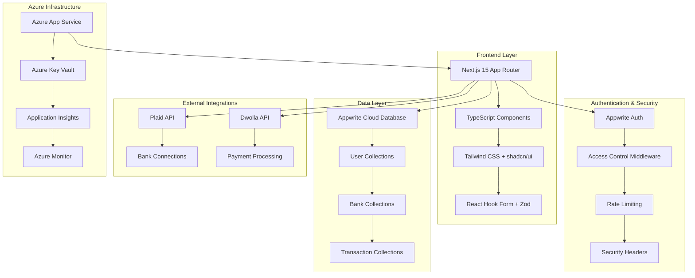

<div align="center">
  
  
  <h1 align="center">🏦 Horizon Banking Portal</h1>
  <p align="center">
    <strong>Enterprise-Grade Private Banking Platform</strong><br>
    Secure • Scalable • Azure-Ready
  </p>
  
  <div align="center">
    
    
    
    
    
    
  </div>

  <br />
  
  <div align="center">
    <a href="#features">Features</a> •
    <a href="#quick-start">Quick Start</a> •
    <a href="#deployment">Azure Deployment</a> •
    <a href="#documentation">Documentation</a> •
    <a href="#security">Security</a>
  </div>
</div>

<br />

> **🚀 Production Ready**: This banking portal is enterprise-ready with comprehensive Azure deployment guides, security hardening, and extensive documentation for private banking operations.</div>

## 📋 Table of Contents

- [🎯 Overview](#overview)
- [✨ Key Features](#features)
- [🏗️ Architecture](#architecture)
- [⚙️ Tech Stack](#tech-stack)
- [� Quick Start](#quick-start)
- [🌐 Azure Deployment](#deployment)
- [� Security Features](#security)
- [� Documentation](#documentation)
- [🧪 Testing](#testing)
- [🎨 Theming & Branding](#theming)
- [🔧 Configuration](#configuration)
- [📊 Monitoring](#monitoring)
- [🤝 Contributing](#contributing)
- [📄 License](#license)

---

## 🎯 Overview {#overview}

**Horizon Banking Portal** is an enterprise-grade private banking platform designed for secure financial operations. Built with modern technologies and deployed on Microsoft Azure, it provides comprehensive banking services with advanced security measures and compliance features.

### 🌟 What Makes It Special

- **🏦 Private Banking Focus**: Tailored for high-net-worth individuals and private banking operations
- **🛡️ Enterprise Security**: Multi-layer security with rate limiting, access controls, and audit trails
- **☁️ Azure-Native**: Designed for seamless deployment on Microsoft Azure with UAE compliance
- **📱 Modern UX**: Beautiful, responsive interface with Horizon branding
- **🔄 Real-time Operations**: Live transaction monitoring and instant updates
- **📊 Comprehensive Reporting**: Advanced export capabilities with PDF statements and CSV data

---

## 🏗️ Architecture {#architecture}



### **Key Architectural Decisions**

- **🎯 Server-Side Rendering**: Optimized performance with Next.js App Router
- **☁️ Cloud-Native**: Appwrite Cloud for scalable backend services
- **🔒 Security-First**: Multiple security layers with rate limiting and access controls
- **📊 Monitoring**: Comprehensive logging and monitoring with Azure services
- **🌐 API-First**: RESTful APIs with proper error handling and validation

---

## ⚙️ Tech Stack {#tech-stack}

### **Frontend**
- **[Next.js 15](https://nextjs.org/)** - React framework with App Router
- **[TypeScript](https://www.typescriptlang.org/)** - Type-safe JavaScript
- **[Tailwind CSS](https://tailwindcss.com/)** - Utility-first CSS framework
- **[shadcn/ui](https://ui.shadcn.com/)** - Modern UI component library
- **[React Hook Form](https://react-hook-form.com/)** - Performant form handling
- **[Zod](https://zod.dev/)** - Schema validation library
- **[Chart.js](https://www.chartjs.org/)** - Data visualization

### **Backend & Database**
- **[Appwrite Cloud](https://appwrite.io/)** - Backend-as-a-Service platform
- **[Node.js Runtime](https://nodejs.org/)** - Server-side JavaScript execution
- **Server Actions** - Next.js server-side data mutations

### **Payment & Banking**
- **[Plaid](https://plaid.com/)** - Bank account linking and verification
- **[Dwolla](https://www.dwolla.com/)** - ACH payment processing
- **Real-time Webhooks** - Instant transaction updates

### **Infrastructure & DevOps**
- **[Microsoft Azure](https://azure.microsoft.com/)** - Cloud platform
- **[Azure App Service](https://azure.microsoft.com/en-us/services/app-service/)** - Web application hosting
- **[Azure Key Vault](https://azure.microsoft.com/en-us/services/key-vault/)** - Secrets management
- **[Application Insights](https://azure.microsoft.com/en-us/services/monitor/)** - Application monitoring

### **Security & Compliance**
- **Rate Limiting** - API protection with configurable limits
- **HTTPS Enforcement** - End-to-end encryption
- **Security Headers** - Comprehensive HTTP security
- **Access Controls** - Email-based allowlisting

---

## ✨ Key Features {#features}

### � **Authentication & Access Control**
- **Secure SSR Authentication**: Ultra-secure server-side rendering with proper validations
- **Access Control Lists**: Email-based allowlisting with `ALLOWED_EMAILS` configuration
- **Session Management**: Comprehensive user session handling with automatic expiry

### 🏦 **Banking Operations**
- **Multi-Bank Integration**: Connect multiple bank accounts via Plaid integration
- **Real-time Transactions**: Live transaction monitoring and instant balance updates
- **Manual Transaction Entry**: Complete workflow for manual transaction recording
- **Fund Transfers**: Secure money transfers using Dwolla payment infrastructure

### � **Financial Management**
- **Dashboard Overview**: Comprehensive financial summary with balance aggregation
- **Transaction History**: Advanced filtering, pagination, and search capabilities
- **Category Analytics**: Spending analysis with visual charts and insights
- **Account Management**: Complete bank account details and management tools

### 📋 **Reporting & Exports**
- **CSV Export**: Filtered transaction exports with customizable date ranges
- **PDF Statements**: Branded monthly/quarterly statements with bank logos
- **Statement Dashboard**: Unified view of all account statements and exports
- **Print-Ready Reports**: Professional formatting for physical document needs

### 🎨 **Branding & Customization**
- **Horizon Theme**: Professional banking theme with blue-gold color palette
- **Legal Compliance**: Built-in disclaimer pages and regulatory compliance
- **Responsive Design**: Seamless experience across desktop, tablet, and mobile
- **Accessibility**: WCAG-compliant design with screen reader support

### 🛡️ **Security & Compliance**
- **Rate Limiting**: API endpoint protection with configurable limits
- **Security Headers**: Comprehensive HTTP security headers implementation
- **Audit Logging**: Complete transaction and access logging
- **Data Encryption**: End-to-end encryption for sensitive financial data

### 🚀 **Feature Flags & Configuration**
- **Plaid Toggle**: `NEXT_PUBLIC_ENABLE_PLAID` - Enable/disable bank linking
- **Transfer Toggle**: `NEXT_PUBLIC_ENABLE_TRANSFERS` - Control money transfer features
- **Environment-Specific**: Different configurations for development, staging, production

---

## 🚀 Quick Start {#quick-start}

### **Prerequisites**

Ensure you have the following installed:

- **[Node.js 18+](https://nodejs.org/)** - JavaScript runtime
- **[Git](https://git-scm.com/)** - Version control
- **[npm](https://www.npmjs.com/)** or **[yarn](https://yarnpkg.com/)** - Package manager

### **1. Clone the Repository**

```bash
git clone https://github.com/CoronovirusG10/evidencing.git
cd banking
```

### **2. Install Dependencies**

```bash
npm install
```

### **3. Environment Configuration**

Create a `.env.local` file in the root directory:

```env
# Application
NEXT_PUBLIC_SITE_URL=http://localhost:3000

# Appwrite Configuration
NEXT_PUBLIC_APPWRITE_ENDPOINT=https://cloud.appwrite.io/v1
NEXT_PUBLIC_APPWRITE_PROJECT=your_project_id
APPWRITE_DATABASE_ID=your_database_id
APPWRITE_USER_COLLECTION_ID=your_user_collection_id
APPWRITE_BANK_COLLECTION_ID=your_bank_collection_id
APPWRITE_TRANSACTION_COLLECTION_ID=your_transaction_collection_id
NEXT_APPWRITE_KEY=your_server_api_key

# Access Control
ALLOWED_EMAILS=admin@yourbank.com,manager@yourbank.com

# Feature Flags
NEXT_PUBLIC_ENABLE_PLAID=true
NEXT_PUBLIC_ENABLE_TRANSFERS=true

# Plaid Integration
PLAID_CLIENT_ID=your_plaid_client_id
PLAID_SECRET=your_plaid_secret
PLAID_ENV=sandbox
PLAID_PRODUCTS=transactions,auth,identity
PLAID_COUNTRY_CODES=US,CA

# Dwolla Integration
DWOLLA_KEY=your_dwolla_key
DWOLLA_SECRET=your_dwolla_secret
DWOLLA_BASE_URL=https://api-sandbox.dwolla.com
DWOLLA_ENV=sandbox
```

### **4. Database Setup**

Follow the [Appwrite Cloud Setup Guide](docs/appwrite-cloud-setup.md) to configure your database collections.

### **5. Run the Application**

```bash
# Development mode
npm run dev

# Production build
npm run build
npm start
```

The application will be available at `http://localhost:3000`

### **6. Run Tests**

```bash
# Run all tests
npm run test

# Run linting
npm run lint
```

---

## 🌐 Azure Deployment {#deployment}

### **UAE North Region Deployment**

This application is optimized for deployment on Microsoft Azure, specifically in the **UAE North** region for compliance with local regulations.

#### **🔧 Infrastructure Setup**

```bash
# Login to Azure CLI
az login

# Create Resource Group
az group create --name horizon-rg-uae --location "UAE North"

# Create App Service Plan
az appservice plan create \
  --name horizon-asp-uae \
  --resource-group horizon-rg-uae \
  --location "UAE North" \
  --sku P1V3 \
  --is-linux

# Create Web App
az webapp create \
  --name horizon-banking-uae \
  --resource-group horizon-rg-uae \
  --plan horizon-asp-uae \
  --runtime "NODE|20-lts"
```

#### **� Secrets Management**

```bash
# Create Key Vault
az keyvault create \
  --name horizon-kv-uae \
  --resource-group horizon-rg-uae \
  --location "UAE North"

# Add secrets
az keyvault secret set --vault-name horizon-kv-uae --name "appwrite-key" --value "your-key"
az keyvault secret set --vault-name horizon-kv-uae --name "plaid-secret" --value "your-secret"
```

#### **📋 Deployment Checklist**

- [ ] Azure resources provisioned in UAE North
- [ ] Key Vault configured with all secrets
- [ ] App Service configured with Key Vault references
- [ ] Custom domain and SSL certificate configured
- [ ] Application Insights enabled
- [ ] Backup and disaster recovery configured
- [ ] Monitoring and alerts set up

#### **📚 Detailed Guide**

For complete deployment instructions, see: **[Azure Deployment Guide](docs/azure-deployment.md)**

---

## 🔒 Security Features {#security}

### **🛡️ Authentication & Authorization**
- **Multi-layer Authentication**: Appwrite Auth with custom middleware
- **Access Control Lists**: Email-based user allowlisting
- **Session Management**: Secure session handling with automatic expiry
- **Role-based Access**: Granular permissions for different user types

### **🚦 Rate Limiting**
```typescript
// API endpoints protected with rate limiting
const rateLimit = new Map()

// 5 requests per minute for exports
export async function POST(request: Request) {
  const limited = await checkRateLimit(userEmail, 5, 60000)
  if (limited) {
    return new Response('Rate limit exceeded', { status: 429 })
  }
  // Process request...
}
```

### **🔐 Security Headers**
```javascript
// next.config.mjs - Comprehensive security headers
const securityHeaders = [
  { key: 'X-DNS-Prefetch-Control', value: 'on' },
  { key: 'X-XSS-Protection', value: '1; mode=block' },
  { key: 'X-Frame-Options', value: 'SAMEORIGIN' },
  { key: 'X-Content-Type-Options', value: 'nosniff' },
  { key: 'Referrer-Policy', value: 'origin-when-cross-origin' }
]
```

### **📊 Audit & Compliance**
- **Transaction Logging**: Complete audit trail for all financial operations
- **Access Logging**: User access and activity monitoring
- **Data Encryption**: End-to-end encryption for sensitive data
- **Backup Strategy**: Automated backups with point-in-time recovery

---

## 📚 Documentation {#documentation}

### **📖 Available Guides**

| Document | Description |
|----------|-------------|
| **[Azure Deployment Guide](docs/azure-deployment.md)** | Complete Azure deployment instructions for UAE region |
| **[Appwrite Cloud Setup](docs/appwrite-cloud-setup.md)** | Database configuration and collections setup |
| **[Theming Guide](docs/theming-guide.md)** | Customize branding, colors, and UI components |
| **[Manual Test Plan](docs/manual-test-plan.md)** | Comprehensive testing procedures |
| **[Tooling Guide](docs/tooling.md)** | Development tools and pre-commit hooks |
| **[Change Log](docs/CHANGELOG.md)** | Version history and feature updates |

### **🔄 API Documentation**

#### **Transaction Export API**
```typescript
// POST /api/transactions/export
{
  "format": "csv" | "pdf",
  "filters": {
    "startDate": "2024-01-01",
    "endDate": "2024-12-31",
    "accountId": "account_123"
  }
}
```

#### **Manual Transaction API**
```typescript
// POST /api/transactions/manual
{
  "amount": 1000.00,
  "description": "Wire transfer received",
  "category": "deposit",
  "accountId": "account_123"
}
```

---

## 🧪 Testing {#testing}

### **Test Coverage**

```bash
# Run all tests
npm run test

# Run specific test suites
npm run test:csv      # CSV export functionality
npm run test:pdf      # PDF generation
npm run test:auth     # Authentication flows
```

### **Test Structure**
```
tests/
├── csv.test.ts           # CSV export validation
├── pdf.test.ts           # PDF generation testing
├── auth.test.ts          # Authentication testing
└── integration/          # End-to-end tests
    ├── banking.test.ts
    └── exports.test.ts
```

### **Manual Testing**

Follow the comprehensive [Manual Test Plan](docs/manual-test-plan.md) for complete feature validation.

---

## 🎨 Theming & Branding {#theming}

### **🎨 Horizon Brand Colors**

```css
:root {
  /* Primary Colors */
  --primary-blue: #0066CC;
  --primary-gold: #FFD700;
  
  /* Semantic Colors */
  --success: #10B981;
  --warning: #F59E0B;
  --error: #EF4444;
  --info: #3B82F6;
  
  /* Neutral Colors */
  --gray-50: #F9FAFB;
  --gray-900: #111827;
}
```

### **📝 Legal & Compliance**

The platform includes:
- **Legal Disclaimer Pages**: Comprehensive terms and conditions
- **Privacy Policy**: GDPR and regional compliance
- **Banking Regulations**: UAE banking law compliance
- **Audit Trail**: Complete transaction logging

### **🔧 Customization Guide**

For complete branding customization, see: **[Theming Guide](docs/theming-guide.md)**

---
PLAID_PRODUCTS=auth,transactions,identity
PLAID_COUNTRY_CODES=US,CA

#DWOLLA
DWOLLA_KEY=
DWOLLA_SECRET=
DWOLLA_BASE_URL=https://api-sandbox.dwolla.com
DWOLLA_ENV=sandbox
```

</details>

<details>
<summary><code>exchangePublicToken</code></summary>

```typescript
// This function exchanges a public token for an access token and item ID
export const exchangePublicToken = async ({
  publicToken,
  user,
}: exchangePublicTokenProps) => {
  try {
    // Exchange public token for access token and item ID
    const response = await plaidClient.itemPublicTokenExchange({
      public_token: publicToken,
    });

    const accessToken = response.data.access_token;
    const itemId = response.data.item_id;

    // Get account information from Plaid using the access token
    const accountsResponse = await plaidClient.accountsGet({
      access_token: accessToken,
    });

    const accountData = accountsResponse.data.accounts[0];

    // Create a processor token for Dwolla using the access token and account ID
    const request: ProcessorTokenCreateRequest = {
      access_token: accessToken,
      account_id: accountData.account_id,
      processor: "dwolla" as ProcessorTokenCreateRequestProcessorEnum,
    };

    const processorTokenResponse =
      await plaidClient.processorTokenCreate(request);
    const processorToken = processorTokenResponse.data.processor_token;

    // Create a funding source URL for the account using the Dwolla customer ID, processor token, and bank name
    const fundingSourceUrl = await addFundingSource({
      dwollaCustomerId: user.dwollaCustomerId,
      processorToken,
      bankName: accountData.name,
    });

    // If the funding source URL is not created, throw an error
    if (!fundingSourceUrl) throw Error;

    // Create a bank account using the user ID, item ID, account ID, access token, funding source URL, and sharable ID
    await createBankAccount({
      userId: user.$id,
      bankId: itemId,
      accountId: accountData.account_id,
      accessToken,
      fundingSourceUrl,
      sharableId: encryptId(accountData.account_id),
    });

    // Revalidate the path to reflect the changes
    revalidatePath("/");

    // Return a success message
    return parseStringify({
      publicTokenExchange: "complete",
    });
  } catch (error) {
    // Log any errors that occur during the process
    console.error("An error occurred while creating exchanging token:", error);
  }
};
```

</details>

<details>
<summary><code>user.actions.ts</code></summary>

```typescript
"use server";

import { revalidatePath } from "next/cache";
import { cookies } from "next/headers";
import { ID, Query } from "node-appwrite";
import {
  CountryCode,
  ProcessorTokenCreateRequest,
  ProcessorTokenCreateRequestProcessorEnum,
  Products,
} from "plaid";

import { plaidClient } from "@/lib/plaid.config";
import {
  parseStringify,
  extractCustomerIdFromUrl,
  encryptId,
} from "@/lib/utils";

import { createAdminClient, createSessionClient } from "../appwrite.config";

import { addFundingSource, createDwollaCustomer } from "./dwolla.actions";

const {
  APPWRITE_DATABASE_ID: DATABASE_ID,
  APPWRITE_USER_COLLECTION_ID: USER_COLLECTION_ID,
  APPWRITE_BANK_COLLECTION_ID: BANK_COLLECTION_ID,
} = process.env;

export const signUp = async ({ password, ...userData }: SignUpParams) => {
  let newUserAccount;

  try {
    // create appwrite user
    const { database, account } = await createAdminClient();
    newUserAccount = await account.create(
      ID.unique(),
      userData.email,
      password,
      `${userData.firstName} ${userData.lastName}`
    );

    if (!newUserAccount) throw new Error("Error creating user");

    // create dwolla customer
    const dwollaCustomerUrl = await createDwollaCustomer({
      ...userData,
      type: "personal",
    });

    if (!dwollaCustomerUrl) throw new Error("Error creating dwolla customer");
    const dwollaCustomerId = extractCustomerIdFromUrl(dwollaCustomerUrl);

    const newUser = await database.createDocument(
      DATABASE_ID!,
      USER_COLLECTION_ID!,
      ID.unique(),
      {
        ...userData,
        userId: newUserAccount.$id,
        dwollaCustomerUrl,
        dwollaCustomerId,
      }
    );

    const session = await account.createEmailPasswordSession(
      userData.email,
      password
    );

    cookies().set("appwrite-session", session.secret, {
      path: "/",
      httpOnly: true,
      sameSite: "strict",
      secure: true,
    });

    return parseStringify(newUser);
  } catch (error) {
    console.error("Error", error);

    // check if account has been created, if so, delete it
    if (newUserAccount?.$id) {
      const { user } = await createAdminClient();
      await user.delete(newUserAccount?.$id);
    }

    return null;
  }
};

export const signIn = async ({ email, password }: signInProps) => {
  try {
    const { account } = await createAdminClient();
    const session = await account.createEmailPasswordSession(email, password);

    cookies().set("appwrite-session", session.secret, {
      path: "/",
      httpOnly: true,
      sameSite: "strict",
      secure: true,
    });

    const user = await getUserInfo({ userId: session.userId });

    return parseStringify(user);
  } catch (error) {
    console.error("Error", error);
    return null;
  }
};

export const getLoggedInUser = async () => {
  try {
    const { account } = await createSessionClient();
    const result = await account.get();

    const user = await getUserInfo({ userId: result.$id });

    return parseStringify(user);
  } catch (error) {
    console.error("Error", error);
    return null;
  }
};

// CREATE PLAID LINK TOKEN
export const createLinkToken = async (user: User) => {
  try {
    const tokeParams = {
      user: {
        client_user_id: user.$id,
      },
      client_name: user.firstName + user.lastName,
      products: ["auth"] as Products[],
      language: "en",
      country_codes: ["US"] as CountryCode[],
    };

    const response = await plaidClient.linkTokenCreate(tokeParams);

    return parseStringify({ linkToken: response.data.link_token });
  } catch (error) {
    console.error(
      "An error occurred while creating a new Horizon user:",
      error
    );
  }
};

// EXCHANGE PLAID PUBLIC TOKEN
// This function exchanges a public token for an access token and item ID
export const exchangePublicToken = async ({
  publicToken,
  user,
}: exchangePublicTokenProps) => {
  try {
    // Exchange public token for access token and item ID
    const response = await plaidClient.itemPublicTokenExchange({
      public_token: publicToken,
    });

    const accessToken = response.data.access_token;
    const itemId = response.data.item_id;

    // Get account information from Plaid using the access token
    const accountsResponse = await plaidClient.accountsGet({
      access_token: accessToken,
    });

    const accountData = accountsResponse.data.accounts[0];

    // Create a processor token for Dwolla using the access token and account ID
    const request: ProcessorTokenCreateRequest = {
      access_token: accessToken,
      account_id: accountData.account_id,
      processor: "dwolla" as ProcessorTokenCreateRequestProcessorEnum,
    };

    const processorTokenResponse =
      await plaidClient.processorTokenCreate(request);
    const processorToken = processorTokenResponse.data.processor_token;

    // Create a funding source URL for the account using the Dwolla customer ID, processor token, and bank name
    const fundingSourceUrl = await addFundingSource({
      dwollaCustomerId: user.dwollaCustomerId,
      processorToken,
      bankName: accountData.name,
    });

    // If the funding source URL is not created, throw an error
    if (!fundingSourceUrl) throw Error;

    // Create a bank account using the user ID, item ID, account ID, access token, funding source URL, and sharable ID
    await createBankAccount({
      userId: user.$id,
      bankId: itemId,
      accountId: accountData.account_id,
      accessToken,
      fundingSourceUrl,
      sharableId: encryptId(accountData.account_id),
    });

    // Revalidate the path to reflect the changes
    revalidatePath("/");

    // Return a success message
    return parseStringify({
      publicTokenExchange: "complete",
    });
  } catch (error) {
    // Log any errors that occur during the process
    console.error("An error occurred while creating exchanging token:", error);
  }
};

export const getUserInfo = async ({ userId }: getUserInfoProps) => {
  try {
    const { database } = await createAdminClient();

    const user = await database.listDocuments(
      DATABASE_ID!,
      USER_COLLECTION_ID!,
      [Query.equal("userId", [userId])]
    );

    if (user.total !== 1) return null;

    return parseStringify(user.documents[0]);
  } catch (error) {
    console.error("Error", error);
    return null;
  }
};

export const createBankAccount = async ({
  accessToken,
  userId,
  accountId,
  bankId,
  fundingSourceUrl,
  sharableId,
}: createBankAccountProps) => {
  try {
    const { database } = await createAdminClient();

    const bankAccount = await database.createDocument(
      DATABASE_ID!,
      BANK_COLLECTION_ID!,
      ID.unique(),
      {
        accessToken,
        userId,
        accountId,
        bankId,
        fundingSourceUrl,
        sharableId,
      }
    );

    return parseStringify(bankAccount);
  } catch (error) {
    console.error("Error", error);
    return null;
  }
};

// get user bank accounts
export const getBanks = async ({ userId }: getBanksProps) => {
  try {
    const { database } = await createAdminClient();

    const banks = await database.listDocuments(
      DATABASE_ID!,
      BANK_COLLECTION_ID!,
      [Query.equal("userId", [userId])]
    );

    return parseStringify(banks.documents);
  } catch (error) {
    console.error("Error", error);
    return null;
  }
};

// get specific bank from bank collection by document id
export const getBank = async ({ documentId }: getBankProps) => {
  try {
    const { database } = await createAdminClient();

    const bank = await database.listDocuments(
      DATABASE_ID!,
      BANK_COLLECTION_ID!,
      [Query.equal("$id", [documentId])]
    );

    if (bank.total !== 1) return null;

    return parseStringify(bank.documents[0]);
  } catch (error) {
    console.error("Error", error);
    return null;
  }
};

// get specific bank from bank collection by account id
export const getBankByAccountId = async ({
  accountId,
}: getBankByAccountIdProps) => {
  try {
    const { database } = await createAdminClient();

    const bank = await database.listDocuments(
      DATABASE_ID!,
      BANK_COLLECTION_ID!,
      [Query.equal("accountId", [accountId])]
    );

    if (bank.total !== 1) return null;

    return parseStringify(bank.documents[0]);
  } catch (error) {
    console.error("Error", error);
    return null;
  }
};
```
  
</details>

<details>
<summary><code>dwolla.actions.ts</code></summary>

```typescript
"use server";

import { Client } from "dwolla-v2";

const getEnvironment = (): "production" | "sandbox" => {
  const environment = process.env.DWOLLA_ENV as string;

  switch (environment) {
    case "sandbox":
      return "sandbox";
    case "production":
      return "production";
    default:
      throw new Error(
        "Dwolla environment should either be set to `sandbox` or `production`"
      );
  }
};

const dwollaClient = new Client({
  environment: getEnvironment(),
  key: process.env.DWOLLA_KEY as string,
  secret: process.env.DWOLLA_SECRET as string,
});

// Create a Dwolla Funding Source using a Plaid Processor Token
export const createFundingSource = async (
  options: CreateFundingSourceOptions
) => {
  try {
    return await dwollaClient
      .post(`customers/${options.customerId}/funding-sources`, {
        name: options.fundingSourceName,
        plaidToken: options.plaidToken,
      })
      .then((res) => res.headers.get("location"));
  } catch (err) {
    console.error("Creating a Funding Source Failed: ", err);
  }
};

export const createOnDemandAuthorization = async () => {
  try {
    const onDemandAuthorization = await dwollaClient.post(
      "on-demand-authorizations"
    );
    const authLink = onDemandAuthorization.body._links;
    return authLink;
  } catch (err) {
    console.error("Creating an On Demand Authorization Failed: ", err);
  }
};

export const createDwollaCustomer = async (
  newCustomer: NewDwollaCustomerParams
) => {
  try {
    return await dwollaClient
      .post("customers", newCustomer)
      .then((res) => res.headers.get("location"));
  } catch (err) {
    console.error("Creating a Dwolla Customer Failed: ", err);
  }
};

export const createTransfer = async ({
  sourceFundingSourceUrl,
  destinationFundingSourceUrl,
  amount,
}: TransferParams) => {
  try {
    const requestBody = {
      _links: {
        source: {
          href: sourceFundingSourceUrl,
        },
        destination: {
          href: destinationFundingSourceUrl,
        },
      },
      amount: {
        currency: "USD",
        value: amount,
      },
    };
    return await dwollaClient
      .post("transfers", requestBody)
      .then((res) => res.headers.get("location"));
  } catch (err) {
    console.error("Transfer fund failed: ", err);
  }
};

export const addFundingSource = async ({
  dwollaCustomerId,
  processorToken,
  bankName,
}: AddFundingSourceParams) => {
  try {
    // create dwolla auth link
    const dwollaAuthLinks = await createOnDemandAuthorization();

    // add funding source to the dwolla customer & get the funding source url
    const fundingSourceOptions = {
      customerId: dwollaCustomerId,
      fundingSourceName: bankName,
      plaidToken: processorToken,
      _links: dwollaAuthLinks,
    };
    return await createFundingSource(fundingSourceOptions);
  } catch (err) {
    console.error("Transfer fund failed: ", err);
  }
};
```

</details>

<details>
<summary><code>bank.actions.ts</code></summary>

```typescript
"use server";

import {
  ACHClass,
  CountryCode,
  TransferAuthorizationCreateRequest,
  TransferCreateRequest,
  TransferNetwork,
  TransferType,
} from "plaid";

import { plaidClient } from "../plaid.config";
import { parseStringify } from "../utils";

import { getTransactionsByBankId } from "./transaction.actions";
import { getBanks, getBank } from "./user.actions";

// Get multiple bank accounts
export const getAccounts = async ({ userId }: getAccountsProps) => {
  try {
    // get banks from db
    const banks = await getBanks({ userId });

    const accounts = await Promise.all(
      banks?.map(async (bank: Bank) => {
        // get each account info from plaid
        const accountsResponse = await plaidClient.accountsGet({
          access_token: bank.accessToken,
        });
        const accountData = accountsResponse.data.accounts[0];

        // get institution info from plaid
        const institution = await getInstitution({
          institutionId: accountsResponse.data.item.institution_id!,
        });

        const account = {
          id: accountData.account_id,
          availableBalance: accountData.balances.available!,
          currentBalance: accountData.balances.current!,
          institutionId: institution.institution_id,
          name: accountData.name,
          officialName: accountData.official_name,
          mask: accountData.mask!,
          type: accountData.type as string,
          subtype: accountData.subtype! as string,
          appwriteItemId: bank.$id,
          sharableId: bank.sharableId,
        };

        return account;
      })
    );

    const totalBanks = accounts.length;
    const totalCurrentBalance = accounts.reduce((total, account) => {
      return total + account.currentBalance;
    }, 0);

    return parseStringify({ data: accounts, totalBanks, totalCurrentBalance });
  } catch (error) {
    console.error("An error occurred while getting the accounts:", error);
  }
};

// Get one bank account
export const getAccount = async ({ appwriteItemId }: getAccountProps) => {
  try {
    // get bank from db
    const bank = await getBank({ documentId: appwriteItemId });

    // get account info from plaid
    const accountsResponse = await plaidClient.accountsGet({
      access_token: bank.accessToken,
    });
    const accountData = accountsResponse.data.accounts[0];

    // get transfer transactions from appwrite
    const transferTransactionsData = await getTransactionsByBankId({
      bankId: bank.$id,
    });

    const transferTransactions = transferTransactionsData.documents.map(
      (transferData: Transaction) => ({
        id: transferData.$id,
        name: transferData.name!,
        amount: transferData.amount!,
        date: transferData.$createdAt,
        paymentChannel: transferData.channel,
        category: transferData.category,
        type: transferData.senderBankId === bank.$id ? "debit" : "credit",
      })
    );

    // get institution info from plaid
    const institution = await getInstitution({
      institutionId: accountsResponse.data.item.institution_id!,
    });

    const transactions = await getTransactions({
      accessToken: bank?.accessToken,
    });

    const account = {
      id: accountData.account_id,
      availableBalance: accountData.balances.available!,
      currentBalance: accountData.balances.current!,
      institutionId: institution.institution_id,
      name: accountData.name,
      officialName: accountData.official_name,
      mask: accountData.mask!,
      type: accountData.type as string,
      subtype: accountData.subtype! as string,
      appwriteItemId: bank.$id,
    };

    // sort transactions by date such that the most recent transaction is first
    const allTransactions = [...transactions, ...transferTransactions].sort(
      (a, b) => new Date(b.date).getTime() - new Date(a.date).getTime()
    );

    return parseStringify({
      data: account,
      transactions: allTransactions,
    });
  } catch (error) {
    console.error("An error occurred while getting the account:", error);
  }
};

// Get bank info
export const getInstitution = async ({
  institutionId,
}: getInstitutionProps) => {
  try {
    const institutionResponse = await plaidClient.institutionsGetById({
      institution_id: institutionId,
      country_codes: ["US"] as CountryCode[],
    });

    const intitution = institutionResponse.data.institution;

    return parseStringify(intitution);
  } catch (error) {
    console.error("An error occurred while getting the accounts:", error);
  }
};

// Get transactions
export const getTransactions = async ({
  accessToken,
}: getTransactionsProps) => {
  let hasMore = true;
  let transactions: any = [];

  try {
    // Iterate through each page of new transaction updates for item
    while (hasMore) {
      const response = await plaidClient.transactionsSync({
        access_token: accessToken,
      });

      const data = response.data;

      transactions = response.data.added.map((transaction) => ({
        id: transaction.transaction_id,
        name: transaction.name,
        paymentChannel: transaction.payment_channel,
        type: transaction.payment_channel,
        accountId: transaction.account_id,
        amount: transaction.amount,
        pending: transaction.pending,
        category: transaction.category ? transaction.category[0] : "",
        date: transaction.date,
        image: transaction.logo_url,
      }));

      hasMore = data.has_more;
    }

    return parseStringify(transactions);
  } catch (error) {
    console.error("An error occurred while getting the accounts:", error);
  }
};

// Create Transfer
export const createTransfer = async () => {
  const transferAuthRequest: TransferAuthorizationCreateRequest = {
    access_token: "access-sandbox-cddd20c1-5ba8-4193-89f9-3a0b91034c25",
    account_id: "Zl8GWV1jqdTgjoKnxQn1HBxxVBanm5FxZpnQk",
    funding_account_id: "442d857f-fe69-4de2-a550-0c19dc4af467",
    type: "credit" as TransferType,
    network: "ach" as TransferNetwork,
    amount: "10.00",
    ach_class: "ppd" as ACHClass,
    user: {
      legal_name: "Anne Charleston",
    },
  };
  try {
    const transferAuthResponse =
      await plaidClient.transferAuthorizationCreate(transferAuthRequest);
    const authorizationId = transferAuthResponse.data.authorization.id;

    const transferCreateRequest: TransferCreateRequest = {
      access_token: "access-sandbox-cddd20c1-5ba8-4193-89f9-3a0b91034c25",
      account_id: "Zl8GWV1jqdTgjoKnxQn1HBxxVBanm5FxZpnQk",
      description: "payment",
      authorization_id: authorizationId,
    };

    const responseCreateResponse = await plaidClient.transferCreate(
      transferCreateRequest
    );

    const transfer = responseCreateResponse.data.transfer;
    return parseStringify(transfer);
  } catch (error) {
    console.error(
      "An error occurred while creating transfer authorization:",
      error
    );
  }
};
```

</details>


<details>
<summary><code>BankTabItem.tsx</code></summary>

```typescript
"use client";

import { useSearchParams, useRouter } from "next/navigation";

import { cn, formUrlQuery } from "@/lib/utils";

export const BankTabItem = ({ account, appwriteItemId }: BankTabItemProps) => {
  const searchParams = useSearchParams();
  const router = useRouter();
  const isActive = appwriteItemId === account?.appwriteItemId;

  const handleBankChange = () => {
    const newUrl = formUrlQuery({
      params: searchParams.toString(),
      key: "id",
      value: account?.appwriteItemId,
    });
    router.push(newUrl, { scroll: false });
  };

  return (
    <div
      onClick={handleBankChange}
      className={cn(`banktab-item`, {
        " border-blue-600": isActive,
      })}
    >
      <p
        className={cn(`text-16 line-clamp-1 flex-1 font-medium text-gray-500`, {
          " text-blue-600": isActive,
        })}
      >
        {account.name}
      </p>
    </div>
  );
};
```

</details>

<details>
<summary><code>BankInfo.tsx</code></summary>

```typescript
"use client";

import Image from "next/image";
import { useSearchParams, useRouter } from "next/navigation";

import {
  cn,
  formUrlQuery,
  formatAmount,
  getAccountTypeColors,
} from "@/lib/utils";

const BankInfo = ({ account, appwriteItemId, type }: BankInfoProps) => {
  const router = useRouter();
  const searchParams = useSearchParams();

  const isActive = appwriteItemId === account?.appwriteItemId;

  const handleBankChange = () => {
    const newUrl = formUrlQuery({
      params: searchParams.toString(),
      key: "id",
      value: account?.appwriteItemId,
    });
    router.push(newUrl, { scroll: false });
  };

  const colors = getAccountTypeColors(account?.type as AccountTypes);

  return (
    <div
      onClick={handleBankChange}
      className={cn(`bank-info ${colors.bg}`, {
        "shadow-sm border-blue-700": type === "card" && isActive,
        "rounded-xl": type === "card",
        "hover:shadow-sm cursor-pointer": type === "card",
      })}
    >
      <figure
        className={`flex-center h-fit rounded-full bg-blue-100 ${colors.lightBg}`}
      >
        <Image
          src="/icons/connect-bank.svg"
          width={20}
          height={20}
          alt={account.subtype}
          className="m-2 min-w-5"
        />
      </figure>
      <div className="flex w-full flex-1 flex-col justify-center gap-1">
        <div className="bank-info_content">
          <h2
            className={`text-16 line-clamp-1 flex-1 font-bold text-blue-900 ${colors.title}`}
          >
            {account.name}
          </h2>
          {type === "full" && (
            <p
              className={`text-12 rounded-full px-3 py-1 font-medium text-blue-700 ${colors.subText} ${colors.lightBg}`}
            >
              {account.subtype}
            </p>
          )}
        </div>

        <p className={`text-16 font-medium text-blue-700 ${colors.subText}`}>
          {formatAmount(account.currentBalance)}
        </p>
      </div>
    </div>
  );
};

export default BankInfo;
```

</details>

<details>
<summary><code>Copy.tsx</code></summary>

```typescript
"use client";
import { useState } from "react";

import { Button } from "./ui/button";

const Copy = ({ title }: { title: string }) => {
  const [hasCopied, setHasCopied] = useState(false);

  const copyToClipboard = () => {
    navigator.clipboard.writeText(title);
    setHasCopied(true);

    setTimeout(() => {
      setHasCopied(false);
    }, 2000);
  };

  return (
    <Button
      data-state="closed"
      className="mt-3 flex max-w-[320px] gap-4"
      variant="secondary"
      onClick={copyToClipboard}
    >
      <p className="line-clamp-1 w-full max-w-full text-xs font-medium text-black-2">
        {title}
      </p>

      {!hasCopied ? (
        <svg
          xmlns="http://www.w3.org/2000/svg"
          width="24"
          height="24"
          viewBox="0 0 24 24"
          fill="none"
          stroke="currentColor"
          stroke-width="2"
          stroke-linecap="round"
          stroke-linejoin="round"
          className="mr-2 size-4"
        >
          <rect width="14" height="14" x="8" y="8" rx="2" ry="2"></rect>
          <path d="M4 16c-1.1 0-2-.9-2-2V4c0-1.1.9-2 2-2h10c1.1 0 2 .9 2 2"></path>
        </svg>
      ) : (
        <svg
          xmlns="http://www.w3.org/2000/svg"
          width="24"
          height="24"
          viewBox="0 0 24 24"
          fill="none"
          stroke="currentColor"
          stroke-width="2"
          stroke-linecap="round"
          stroke-linejoin="round"
          className="mr-2 size-4"
        >
          <polyline points="20 6 9 17 4 12"></polyline>
        </svg>
      )}
    </Button>
  );
};

export default Copy;
```

</details>

<details>
<summary><code>PaymentTransferForm.tsx</code></summary>

```typescript
"use client";

import { zodResolver } from "@hookform/resolvers/zod";
import { Loader2 } from "lucide-react";
import { useRouter } from "next/navigation";
import { useState } from "react";
import { useForm } from "react-hook-form";
import * as z from "zod";

import { createTransfer } from "@/lib/actions/dwolla.actions";
import { createTransaction } from "@/lib/actions/transaction.actions";
import { getBank, getBankByAccountId } from "@/lib/actions/user.actions";
import { decryptId } from "@/lib/utils";

import { BankDropdown } from "./bank/BankDropdown";
import { Button } from "./ui/button";
import {
  Form,
  FormControl,
  FormDescription,
  FormField,
  FormItem,
  FormLabel,
  FormMessage,
} from "./ui/form";
import { Input } from "./ui/input";
import { Textarea } from "./ui/textarea";

const formSchema = z.object({
  email: z.string().email("Invalid email address"),
  name: z.string().min(4, "Transfer note is too short"),
  amount: z.string().min(4, "Amount is too short"),
  senderBank: z.string().min(4, "Please select a valid bank account"),
  sharableId: z.string().min(8, "Please select a valid sharable Id"),
});

const PaymentTransferForm = ({ accounts }: PaymentTransferFormProps) => {
  const router = useRouter();
  const [isLoading, setIsLoading] = useState(false);

  const form = useForm<z.infer<typeof formSchema>>({
    resolver: zodResolver(formSchema),
    defaultValues: {
      name: "",
      email: "",
      amount: "",
      senderBank: "",
      sharableId: "",
    },
  });

  const submit = async (data: z.infer<typeof formSchema>) => {
    setIsLoading(true);

    try {
      const receiverAccountId = decryptId(data.sharableId);
      const receiverBank = await getBankByAccountId({
        accountId: receiverAccountId,
      });
      const senderBank = await getBank({ documentId: data.senderBank });

      const transferParams = {
        sourceFundingSourceUrl: senderBank.fundingSourceUrl,
        destinationFundingSourceUrl: receiverBank.fundingSourceUrl,
        amount: data.amount,
      };
      // create transfer
      const transfer = await createTransfer(transferParams);

      // create transfer transaction
      if (transfer) {
        const transaction = {
          name: data.name,
          amount: data.amount,
          senderId: senderBank.userId.$id,
          senderBankId: senderBank.$id,
          receiverId: receiverBank.userId.$id,
          receiverBankId: receiverBank.$id,
          email: data.email,
        };

        const newTransaction = await createTransaction(transaction);

        if (newTransaction) {
          form.reset();
          router.push("/");
        }
      }
    } catch (error) {
      console.error("Submitting create transfer request failed: ", error);
    }

    setIsLoading(false);
  };

  return (
    <Form {...form}>
      <form onSubmit={form.handleSubmit(submit)} className="flex flex-col">
        <FormField
          control={form.control}
          name="senderBank"
          render={() => (
            <FormItem className="border-t border-gray-200">
              <div className="payment-transfer_form-item pb-6 pt-5">
                <div className="payment-transfer_form-content">
                  <FormLabel className="text-14 font-medium text-gray-700">
                    Select Source Bank
                  </FormLabel>
                  <FormDescription className="text-12 font-normal text-gray-600">
                    Select the bank account you want to transfer funds from
                  </FormDescription>
                </div>
                <div className="flex w-full flex-col">
                  <FormControl>
                    <BankDropdown
                      accounts={accounts}
                      setValue={form.setValue}
                      otherStyles="!w-full"
                    />
                  </FormControl>
                  <FormMessage className="text-12 text-red-500" />
                </div>
              </div>
            </FormItem>
          )}
        />

        <FormField
          control={form.control}
          name="name"
          render={({ field }) => (
            <FormItem className="border-t border-gray-200">
              <div className="payment-transfer_form-item pb-6 pt-5">
                <div className="payment-transfer_form-content">
                  <FormLabel className="text-14 font-medium text-gray-700">
                    Transfer Note (Optional)
                  </FormLabel>
                  <FormDescription className="text-12 font-normal text-gray-600">
                    Please provide any additional information or instructions
                    related to the transfer
                  </FormDescription>
                </div>
                <div className="flex w-full flex-col">
                  <FormControl>
                    <Textarea
                      placeholder="Write a short note here"
                      className="input-class"
                      {...field}
                    />
                  </FormControl>
                  <FormMessage className="text-12 text-red-500" />
                </div>
              </div>
            </FormItem>
          )}
        />

        <div className="payment-transfer_form-details">
          <h2 className="text-18 font-semibold text-gray-900">
            Bank account details
          </h2>
          <p className="text-16 font-normal text-gray-600">
            Enter the bank account details of the recipient
          </p>
        </div>

        <FormField
          control={form.control}
          name="email"
          render={({ field }) => (
            <FormItem className="border-t border-gray-200">
              <div className="payment-transfer_form-item py-5">
                <FormLabel className="text-14 w-full max-w-[280px] font-medium text-gray-700">
                  Recipient&apos;s Email Address
                </FormLabel>
                <div className="flex w-full flex-col">
                  <FormControl>
                    <Input
                      placeholder="ex: johndoe@gmail.com"
                      className="input-class"
                      {...field}
                    />
                  </FormControl>
                  <FormMessage className="text-12 text-red-500" />
                </div>
              </div>
            </FormItem>
          )}
        />

        <FormField
          control={form.control}
          name="sharableId"
          render={({ field }) => (
            <FormItem className="border-t border-gray-200">
              <div className="payment-transfer_form-item pb-5 pt-6">
                <FormLabel className="text-14 w-full max-w-[280px] font-medium text-gray-700">
                  Receiver&apos;s Plaid Sharable Id
                </FormLabel>
                <div className="flex w-full flex-col">
                  <FormControl>
                    <Input
                      placeholder="Enter the public account number"
                      className="input-class"
                      {...field}
                    />
                  </FormControl>
                  <FormMessage className="text-12 text-red-500" />
                </div>
              </div>
            </FormItem>
          )}
        />

        <FormField
          control={form.control}
          name="amount"
          render={({ field }) => (
            <FormItem className="border-y border-gray-200">
              <div className="payment-transfer_form-item py-5">
                <FormLabel className="text-14 w-full max-w-[280px] font-medium text-gray-700">
                  Amount
                </FormLabel>
                <div className="flex w-full flex-col">
                  <FormControl>
                    <Input
                      placeholder="ex: 5.00"
                      className="input-class"
                      {...field}
                    />
                  </FormControl>
                  <FormMessage className="text-12 text-red-500" />
                </div>
              </div>
            </FormItem>
          )}
        />

        <div className="payment-transfer_btn-box">
          <Button type="submit" className="payment-transfer_btn">
            {isLoading ? (
              <>
                <Loader2 size={20} className="animate-spin" /> &nbsp; Sending...
              </>
            ) : (
              "Transfer Funds"
            )}
          </Button>
        </div>
      </form>
    </Form>
  );
};

export default PaymentTransferForm;
```

</details>

<details>
<summary><code>Missing from the video (top right on the transaction list page) BankDropdown.tsx</code></summary>

```typescript
"use client";

import Image from "next/image";
import { useSearchParams, useRouter } from "next/navigation";
import { useState } from "react";

import {
  Select,
  SelectContent,
  SelectGroup,
  SelectItem,
  SelectLabel,
  SelectTrigger,
} from "@/components/ui/select";
import { formUrlQuery, formatAmount } from "@/lib/utils";

export const BankDropdown = ({
  accounts = [],
  setValue,
  otherStyles,
}: BankDropdownProps) => {
  const searchParams = useSearchParams();
  const router = useRouter();
  const [selected, setSeclected] = useState(accounts[0]);

  const handleBankChange = (id: string) => {
    const account = accounts.find((account) => account.appwriteItemId === id)!;

    setSeclected(account);
    const newUrl = formUrlQuery({
      params: searchParams.toString(),
      key: "id",
      value: id,
    });
    router.push(newUrl, { scroll: false });

    if (setValue) {
      setValue("senderBank", id);
    }
  };

  return (
    <Select
      defaultValue={selected.id}
      onValueChange={(value) => handleBankChange(value)}
    >
      <SelectTrigger
        className={`flex w-full gap-3 md:w-[300px] ${otherStyles}`}
      >
        <Image
          src="icons/credit-card.svg"
          width={20}
          height={20}
          alt="account"
        />
        <p className="line-clamp-1 w-full text-left">{selected.name}</p>
      </SelectTrigger>
      <SelectContent
        className={`w-full md:w-[300px] ${otherStyles}`}
        align="end"
      >
        <SelectGroup>
          <SelectLabel className="py-2 font-normal text-gray-500">
            Select a bank to display
          </SelectLabel>
          {accounts.map((account: Account) => (
            <SelectItem
              key={account.id}
              value={account.appwriteItemId}
              className="cursor-pointer border-t"
            >
              <div className="flex flex-col ">
                <p className="text-16 font-medium">{account.name}</p>
                <p className="text-14 font-medium text-blue-600">
                  {formatAmount(account.currentBalance)}
                </p>
              </div>
            </SelectItem>
          ))}
        </SelectGroup>
      </SelectContent>
    </Select>
  );
};
```
  
</details>

<details>
<summary><code>Pagination.tsx</code></summary>

```typescript
"use client";

import Image from "next/image";
import { useRouter, useSearchParams } from "next/navigation";

import { Button } from "@/components/ui/button";
import { formUrlQuery } from "@/lib/utils";

export const Pagination = ({ page, totalPages }: PaginationProps) => {
  const router = useRouter();
  const searchParams = useSearchParams()!;

  const handleNavigation = (type: "prev" | "next") => {
    const pageNumber = type === "prev" ? page - 1 : page + 1;

    const newUrl = formUrlQuery({
      params: searchParams.toString(),
      key: "page",
      value: pageNumber.toString(),
    });

    router.push(newUrl, { scroll: false });
  };

  return (
    <div className="flex justify-between gap-3">
      <Button
        size="lg"
        variant="ghost"
        className="p-0 hover:bg-transparent"
        onClick={() => handleNavigation("prev")}
        disabled={Number(page) <= 1}
      >
        <Image
          src="/icons/arrow-left.svg"
          alt="arrow"
          width={20}
          height={20}
          className="mr-2"
        />
        Prev
      </Button>
      <p className="text-14 flex items-center px-2">
        {page} / {totalPages}
      </p>
      <Button
        size="lg"
        variant="ghost"
        className="p-0 hover:bg-transparent"
        onClick={() => handleNavigation("next")}
        disabled={Number(page) >= totalPages}
      >
        Next
        <Image
          src="/icons/arrow-left.svg"
          alt="arrow"
          width={20}
          height={20}
          className="ml-2 -scale-x-100"
        />
      </Button>
    </div>
  );
};
```

</details>

<details>
<summary><code>Category.tsx</code></summary>

```typescript
import Image from "next/image";

import { topCategoryStyles } from "@/constants";
import { cn } from "@/lib/utils";

import { Progress } from "./ui/progress";

export const Category = ({ category }: CategoryProps) => {
  const {
    bg,
    circleBg,
    text: { main, count },
    progress: { bg: progressBg, indicator },
    icon,
  } = topCategoryStyles[category.name as keyof typeof topCategoryStyles] ||
  topCategoryStyles.default;

  return (
    <div className={cn("gap-[18px] flex p-4 rounded-xl", bg)}>
      <figure className={cn("flex-center size-10 rounded-full", circleBg)}>
        <Image src={icon} width={20} height={20} alt={category.name} />
      </figure>
      <div className="flex w-full flex-1 flex-col gap-2">
        <div className="text-14 flex justify-between">
          <h2 className={cn("font-medium", main)}>{category.name}</h2>
          <h3 className={cn("font-normal", count)}>{category.count}</h3>
        </div>
        <Progress
          value={(category.count / category.totalCount) * 100}
          className={cn("h-2 w-full", progressBg)}
          indicatorClassName={cn("h-2 w-full", indicator)}
        />
      </div>
    </div>
  );
};
```

</details>

## 🔧 Configuration {#configuration}

### **Environment Variables**

| Variable | Description | Required | Default |
|----------|-------------|----------|---------|
| `NEXT_PUBLIC_SITE_URL` | Application base URL | ✅ | - |
| `NEXT_PUBLIC_APPWRITE_ENDPOINT` | Appwrite API endpoint | ✅ | `https://cloud.appwrite.io/v1` |
| `NEXT_PUBLIC_APPWRITE_PROJECT` | Appwrite project ID | ✅ | - |
| `APPWRITE_DATABASE_ID` | Database identifier | ✅ | - |
| `NEXT_APPWRITE_KEY` | Server API key | ✅ | - |
| `ALLOWED_EMAILS` | Comma-separated allowed emails | ✅ | - |
| `NEXT_PUBLIC_ENABLE_PLAID` | Enable Plaid integration | ❌ | `true` |
| `NEXT_PUBLIC_ENABLE_TRANSFERS` | Enable transfer features | ❌ | `true` |
| `PLAID_CLIENT_ID` | Plaid client identifier | ⚠️ | - |
| `PLAID_SECRET` | Plaid secret key | ⚠️ | - |
| `DWOLLA_KEY` | Dwolla API key | ⚠️ | - |
| `DWOLLA_SECRET` | Dwolla secret key | ⚠️ | - |

**Legend:** ✅ Required | ❌ Optional | ⚠️ Required if feature enabled

### **Feature Flags**

```typescript
// Feature flag configuration
export const featureFlags = {
  plaidEnabled: process.env.NEXT_PUBLIC_ENABLE_PLAID === 'true',
  transfersEnabled: process.env.NEXT_PUBLIC_ENABLE_TRANSFERS === 'true',
  rateLimit: {
    exports: 5,        // requests per minute
    windowMs: 60000    // 1 minute
  }
}
```

---

## 📊 Monitoring {#monitoring}

### **Azure Application Insights**

```typescript
// Application monitoring setup
import { ApplicationInsights } from '@microsoft/applicationinsights-web'

const appInsights = new ApplicationInsights({
  config: {
    instrumentationKey: process.env.APPINSIGHTS_INSTRUMENTATIONKEY,
    enableAutoRouteTracking: true,
    enableCorsCorrelation: true
  }
})
```

### **Key Metrics Tracked**

- **Performance**: Page load times, API response times
- **Usage**: User sessions, feature adoption
- **Errors**: Application exceptions, failed transactions
- **Security**: Failed authentication attempts, rate limit hits

### **Monitoring Dashboard**

Access your monitoring dashboard at:
- **Azure Portal**: Application Insights overview
- **Custom Dashboards**: Performance and business metrics
- **Alerts**: Automated notifications for critical issues

---

## 🤝 Contributing {#contributing}

### **Development Workflow**

1. **Fork the repository**
   ```bash
   git fork https://github.com/CoronovirusG10/evidencing.git
   ```

2. **Create a feature branch**
   ```bash
   git checkout -b feature/amazing-feature
   ```

3. **Follow development standards**
   ```bash
   npm run lint        # Check code quality
   npm run test        # Run tests
   npm run type-check  # TypeScript validation
   ```

4. **Commit with conventional commits**
   ```bash
   git commit -m "feat: add amazing feature"
   ```

5. **Submit a pull request**

### **Code Standards**

- **TypeScript**: Strict mode enabled with comprehensive typing
- **ESLint**: Zero warnings policy for production code
- **Prettier**: Automated code formatting
- **Testing**: Required for new features and bug fixes

### **Security Guidelines**

- Never commit sensitive data or API keys
- Follow OWASP security best practices
- Use environment variables for configuration
- Test security features thoroughly

---

## 📄 License {#license}

This project is licensed under the **MIT License**.

```
MIT License

Copyright (c) 2025 Horizon Banking Portal

Permission is hereby granted, free of charge, to any person obtaining a copy
of this software and associated documentation files (the "Software"), to deal
in the Software without restriction, including without limitation the rights
to use, copy, modify, merge, publish, distribute, sublicense, and/or sell
copies of the Software, and to permit persons to whom the Software is
furnished to do so, subject to the following conditions:

The above copyright notice and this permission notice shall be included in all
copies or substantial portions of the Software.

THE SOFTWARE IS PROVIDED "AS IS", WITHOUT WARRANTY OF ANY KIND, EXPRESS OR
IMPLIED, INCLUDING BUT NOT LIMITED TO THE WARRANTIES OF MERCHANTABILITY,
FITNESS FOR A PARTICULAR PURPOSE AND NONINFRINGEMENT. IN NO EVENT SHALL THE
AUTHORS OR COPYRIGHT HOLDERS BE LIABLE FOR ANY CLAIM, DAMAGES OR OTHER
LIABILITY, WHETHER IN AN ACTION OF CONTRACT, TORT OR OTHERWISE, ARISING FROM,
OUT OF OR IN CONNECTION WITH THE SOFTWARE OR THE USE OR OTHER DEALINGS IN THE
SOFTWARE.
```

---

<div align="center">
  <h3>🏦 Horizon Banking Portal</h3>
  <p>Enterprise-grade private banking platform built with modern technologies</p>
  
  <div>
    <a href="https://github.com/CoronovirusG10/evidencing/issues">Report Issues</a> •
    <a href="#quick-start">Get Started</a> •
    <a href="docs/">Documentation</a>
  </div>
  
  <br />
  
  <p><strong>Made with ❤️ for secure banking operations</strong></p>
  
  <div>
    
    
    
  </div>
</div>
